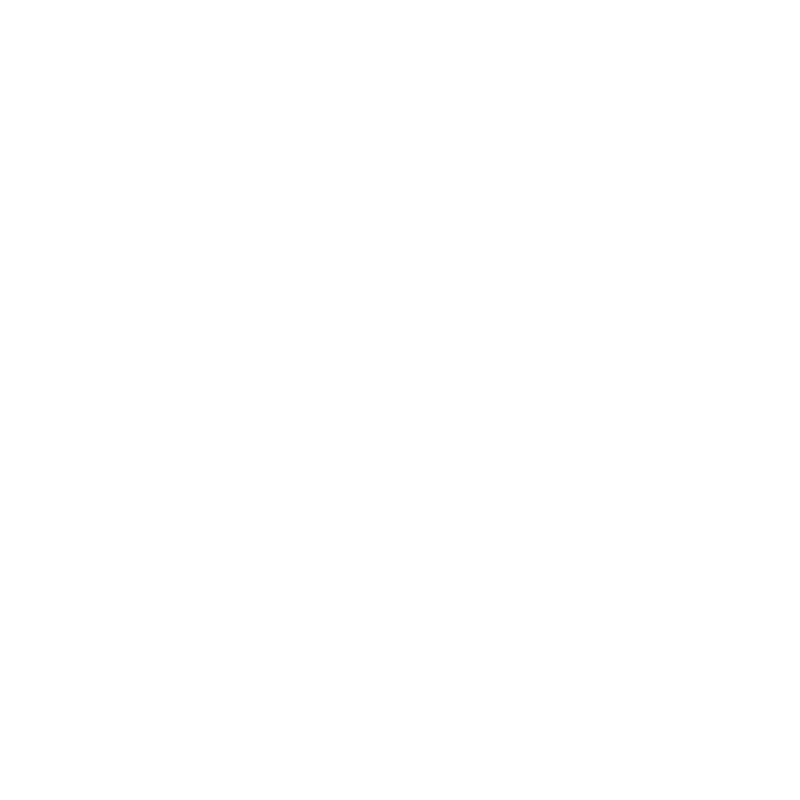
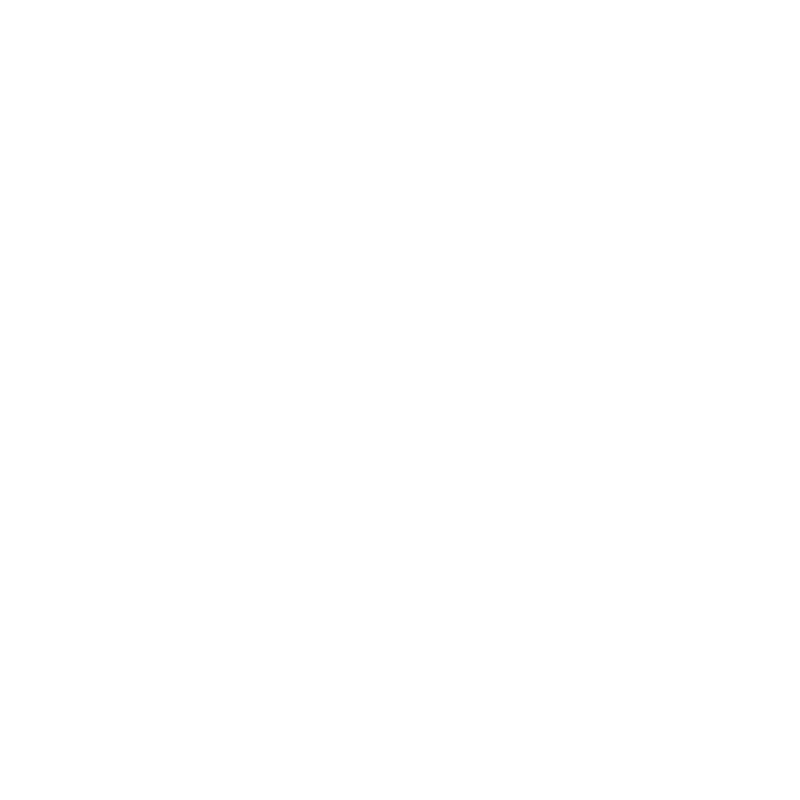
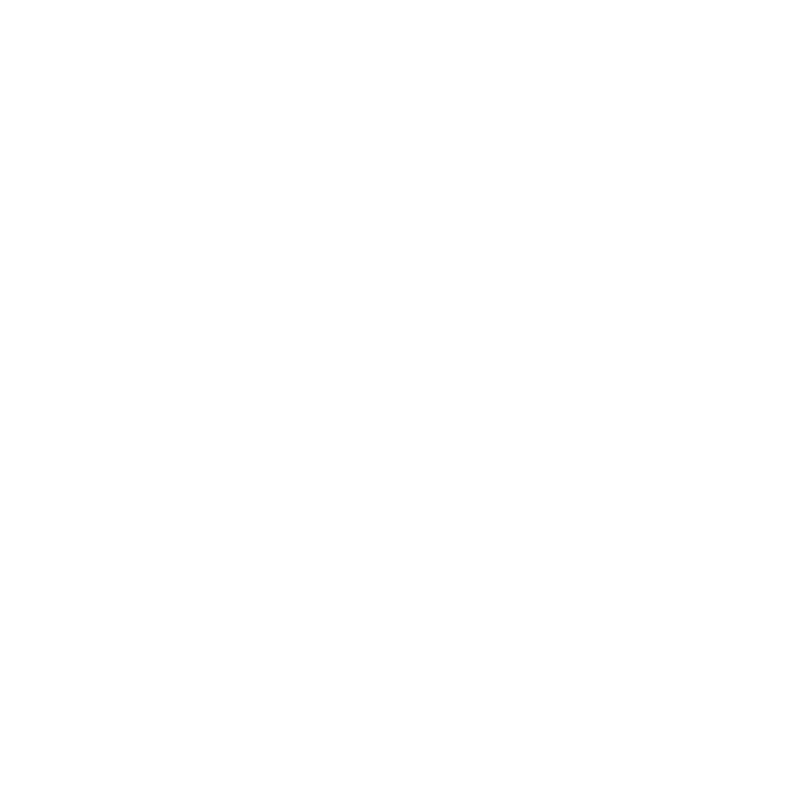
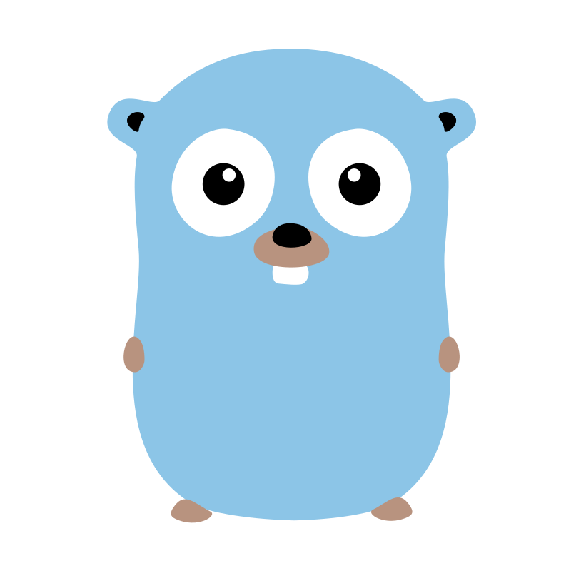

# Hello 👋 I'm Ben Elferink

<!--
**BenElferink/BenElferink** is a ✨ _special_ ✨ repository because its `README.md` (this file) appears on your GitHub profile.
-->

## About Me

- 🖥️ I'm a Fullstack Developer
- 🔭 I’m currently working on [Odigos](https://github.com/odigos-io/odigos)
- 🌱 I’m currently learning <b>Kubernetes (K8S)</b>
- 💬 Ask me about <b>JavaScript / TypeScript</b>
- 🦊 Check out my [Cardano Blockchain Tools](https://labs.badfoxmc.com)
- 📫 How to reach me: [LinkedIn](https://linkedin.com/in/ben-elferink-37ba251b9)
- ⚡ Fun fact: I have a cat 🐈

## GitHub Stats

## Top Languages

## Technologies Used:

